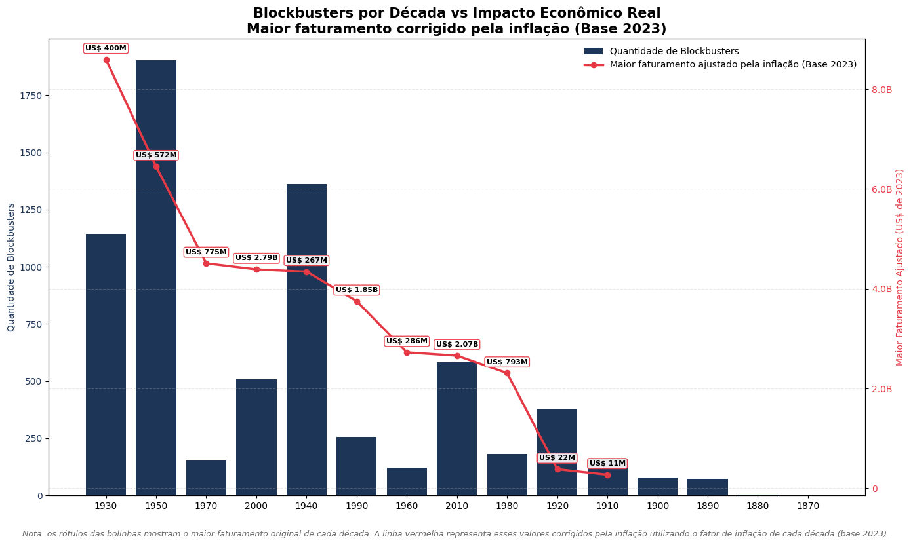
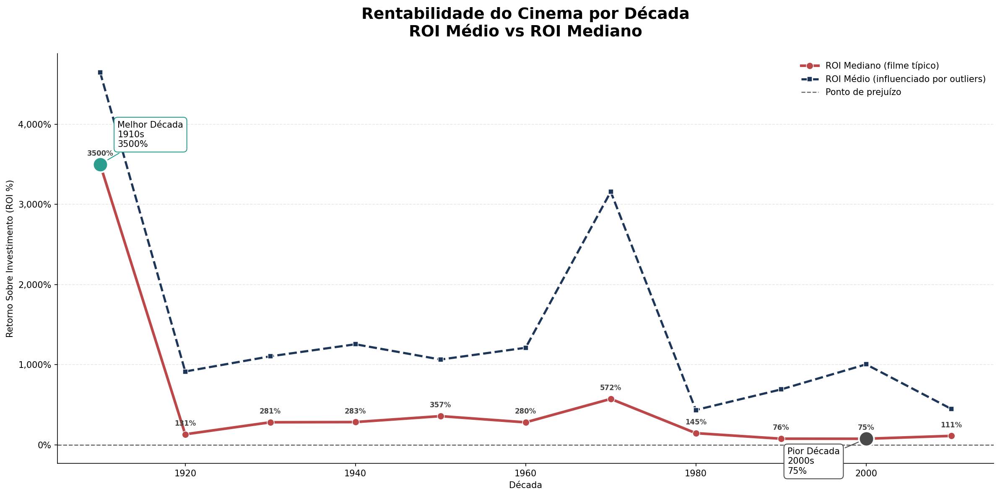
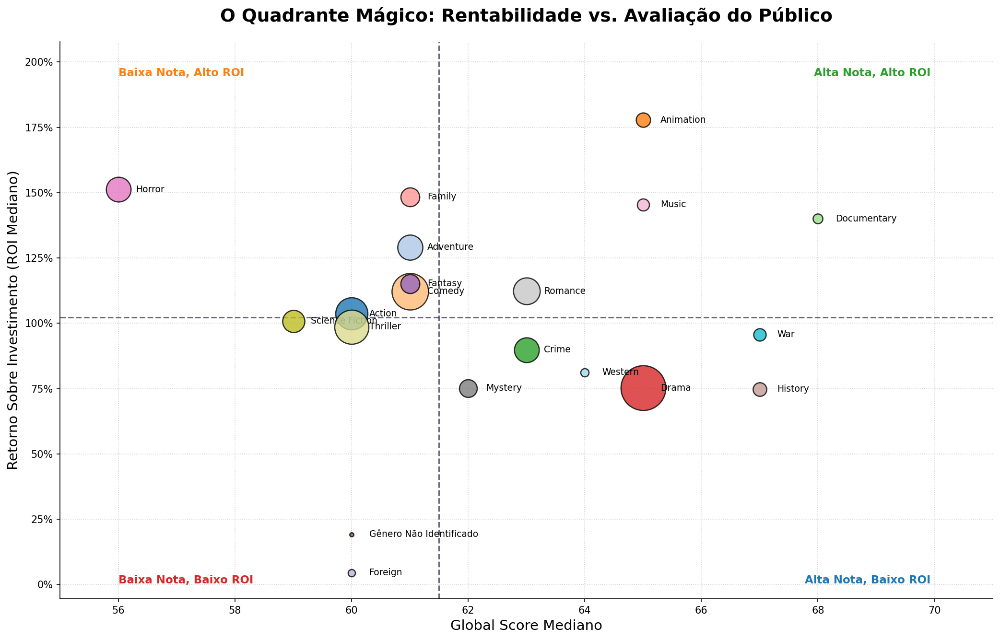
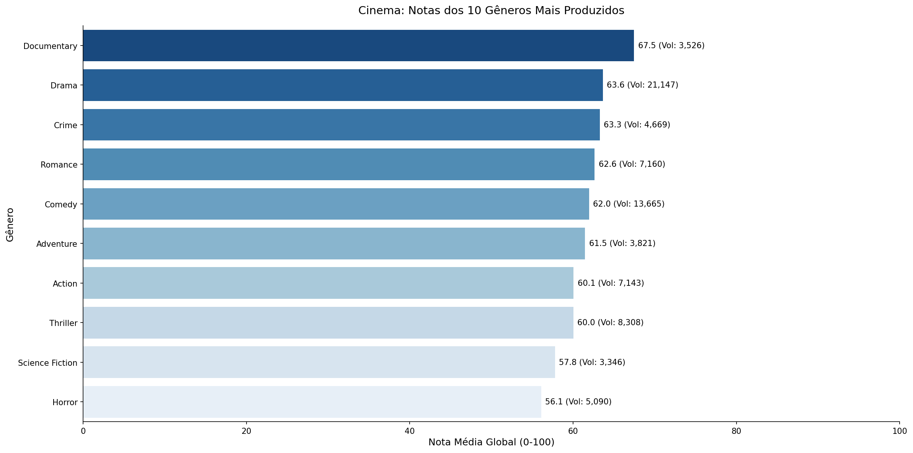
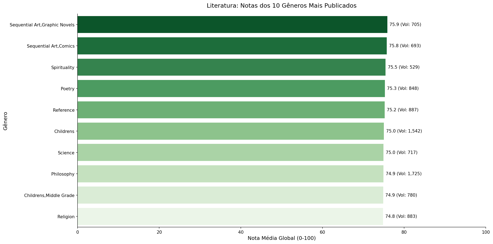
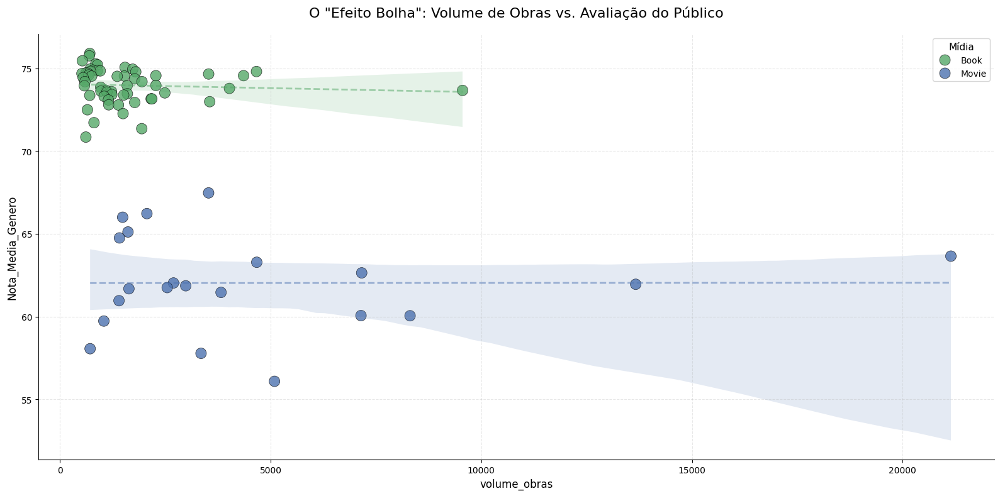
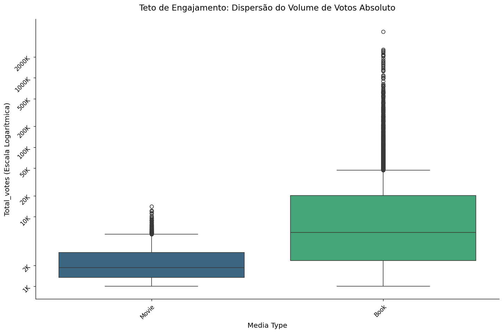

<div align="center">

<br/>

# 🎬📚 Entertainment Industry Performance Analysis

### Cinema vs. Literatura: Volume, Qualidade e Rentabilidade na Indústria do Entretenimento

<br/>


</div>

---

## Sobre o Projeto

Este projeto investiga um dilema clássico da indústria do entretenimento: **produzir mais é produzir melhor?** Para responder essa pergunta, foram unificados e analisados dois universos de dados — **Cinema** (TMDB Movies Dataset) e **Literatura** (Goodreads Books) — construindo um **catálogo de mídia unificado** que permite comparar diretamente volume de produção, qualidade percebida pelo público, engajamento e retorno financeiro entre os dois mercados.

O projeto foi desenhado como uma **pipeline analítica ponta a ponta**: engenharia de dados, EDA em três camadas (univariada, bivariada e multivariada), tratamento estatístico de outliers, análises de negócio orientadas a decisão (analytics) e, por fim, um **dashboard interativo no Power BI** para exploração livre dos achados.

Além de código, este README funciona como um **relatório executivo da análise** — reunindo os principais números, gráficos e conclusões do projeto.

---

## Objetivos

| Etapa | Descrição | Status |
|-------|-----------|--------|
| Profiling | Diagnóstico inicial de qualidade dos datasets brutos | Concluído |
| Limpeza | Tratamento de nulos, tipos e inconsistências | Concluído |
| Feature Engineering | Criação de métricas de negócio (score global, engajamento, década, quadrante de popularidade) | Concluído |
| EDA Univariada | Distribuições individuais por variável (livros e filmes) | Concluído |
| EDA Bivariada | Relações entre pares de variáveis e testes de dependência categórica | Concluído |
| EDA Multivariada | Correlações, pairplots e coordenadas paralelas | Concluído |
| Tratamento de Outliers | Detecção via IQR e decisão de mitigação por domínio | Concluído |
| Unificação | Catálogo unificado Livros + Filmes (Parquet + SQLite) | Concluído |
| Analytics | 5 notebooks de negócio: engajamento, gêneros, financeiro e resumo executivo | Concluído |
| Dashboard | Dashboard interativo em Power BI (4 páginas) | Concluído |

---

## Estrutura do Projeto

```
entertainment_industry_performance_analysis/
│
├── data/
│   ├── raw/                        # Dados originais (Goodreads + TMDB)
│   ├── interim/                    # Dados limpos e enriquecidos (books/movies)
│   ├── processed/                  # Datasets master + catálogo unificado (.parquet/.db)
│   └── powerbi_export/             # Extrações formatadas para o dashboard
│
├── graficos/
│   ├── dashbords/
│   │   ├── gifs/                   # GIFs demonstrativos do dashboard interativo
│   │   ├── dashbord_entertainment_industry.pbix
│   │   └── pdf_dashbord_entertainment_industry.pdf
│   └── graficos_python/            # Gráficos estáticos gerados em matplotlib/seaborn
│
├── notebooks/
│   ├── 01_data_engineering/        # 15 notebooks: profiling → limpeza → features → EDA → unificação
│   └── 02_data_analytics/          # 5 notebooks: analytics de negócio + resumo executivo
│
├── src/
│   ├── io/                         # Carga e persistência de dados (parquet, csv, pkl, SQLite)
│   ├── utils/                      # Qualidade de dados, features, métricas estatísticas, reshaping
│   └── view/
│       ├── plots/                  # Módulos de visualização (univariada, bivariada, multivariada, outliers)
│       └── tables.py                # Templates de tabelas estilizadas (pandas Styler)
│
├── requirements.txt
├── estrutura.txt
├── LICENSE
└── README.md
```

---

## Datasets

| Dataset | Fonte | Escopo |
|---------|-------|--------|
| **Goodreads Books** | Goodreads (via CSV com gêneros) | Título, autor, editora, nota, número de avaliações, páginas, idioma, data de publicação, gêneros |
| **TMDB Movies Dataset** | The Movie Database | Título, orçamento, receita, nota, votos, duração, idioma, país, produtora, gêneros, elenco/keywords |

Os dois datasets passaram por **harmonização de esquema** (`harmonizar_esquema_dados`), mapeando colunas heterogêneas (`vote_average` ↔ `average_rating`, `publisher` ↔ `producer_company`, etc.) para um **modelo canônico único**, permitindo a criação do catálogo unificado `unified_media_catalog`.

---

## Tecnologias Utilizadas

<div align="center">

| Tecnologia | Uso |
|------------|-----|
| **Python 3.13** | Linguagem principal |
| **Pandas / NumPy** | Manipulação, limpeza e feature engineering |
| **SciPy** | Testes estatísticos (Qui-Quadrado, entropia de Shannon) |
| **Matplotlib / Seaborn** | Visualizações estáticas |
| **Plotly** | Visualizações interativas (coordenadas paralelas) |
| **SQLAlchemy / SQLite** | Persistência relacional do catálogo unificado |
| **Power BI** | Dashboard interativo final |
| **Jupyter Notebook** | Exploração e prototipagem |

</div>

---

## 📓 Pipeline de Notebooks

### `01_data_engineering/` — Engenharia de Dados (15 notebooks)

| # | Notebook | Foco |
|---|----------|------|
| 01–02 | `initial_profiling` | Diagnóstico inicial de qualidade (livros e filmes) |
| 03–04 | `cleaning` | Tratamento de nulos, tipos e inconsistências |
| 05–06 | `feature_engineering` | Harmonização de esquema e criação de métricas globais |
| 07–08 | `eda_univariada` | Distribuições individuais de cada variável |
| 09–10 | `eda_bivariada` | Relações entre pares de variáveis (numérica×numérica, categórica×numérica) |
| 11–12 | `eda_multivariada` | Correlações, pairplots e perfis multivariados |
| 13–14 | `feature_engineering_outliers` | Detecção e tratamento de outliers via IQR |
| 15 | `unified_media_catalog` | Construção do catálogo unificado Livros + Filmes |

### `02_data_analytics/` — Analytics de Negócio (5 notebooks)

| # | Notebook | Pergunta de negócio |
|---|----------|----------------------|
| 16 | `analytics_engagement_distribution` | Como se distribui o engajamento do público entre livros e filmes? |
| 17 | `analytics_genre_dynamics` | Produzir mais gêneros gera mais qualidade, ou dilui a qualidade média? |
| 18 | `analytics_financial_timeline` | Como evoluiu a rentabilidade do cinema ao longo das décadas? |
| 19 | `analytics_financial_genres` | Quais gêneros equilibram melhor rentabilidade e avaliação do público? |
| 20 | `executive_summary` | Consolidação executiva de todos os achados do projeto |

---

## 🔩 Módulos (`src/`)

```python
# src/io/
# → data_loader.py:  carga universal (pkl, csv, parquet)
# → data_save.py:     persistência em múltiplos formatos
# → db_client.py:      camada de acesso SQLite (save/query/delete/alter)

# src/utils/
# → cleaners.py:        parsing seguro de strings/dicts/listas aninhadas
# → data_quality.py:   auditoria de dados faltantes (NaN, zeros, listas vazias, datas inválidas)
# → features.py:         harmonização de esquema, features de negócio, tags de elite
# → metrics.py:           resumos estatísticos numéricos, categóricos (com entropia de Shannon) e temporais
# → reshaping.py:        tabelas de contingência para variáveis multi-valoradas

# src/view/plots/
# → univariados.py, bivariados.py, multivariados.py, outliers.py, qualidade.py
# → _formatters.py:  formatação semântica de eixos (moeda, notas, tempo, contagem log)

# src/view/tables.py
# → Templates de tabelas estilizadas (pandas Styler) com paleta semântica por tipo de dado
```

A camada `src/` foi construída com foco em **reutilização entre os dois datasets**: as mesmas funções de qualidade, métricas e visualização atendem tanto o pipeline de livros quanto o de filmes, graças à harmonização de esquema feita na etapa de feature engineering.

---

## Relatório da Análise — Principais Achados

### 1. Cinema: a economia se torna volátil com a escala

A quantidade de blockbusters por década cresceu de forma explosiva a partir dos anos 1990, mas o **retorno sobre investimento (ROI) não acompanhou esse crescimento** — pelo contrário, caiu.



Olhando para o ROI mediano (o filme "típico", sem o efeito de outliers), fica claro que as **primeiras décadas do cinema foram, proporcionalmente, muito mais rentáveis** do que a era dos grandes blockbusters:



> 🔑 **Achado-chave:** a década de 1910 teve o maior ROI mediano (3.500%), enquanto os anos 2000 — o auge em volume de produção — registraram o pior ROI mediano (75%). Mais filmes não significou mais lucratividade relativa; significou um mercado mais competitivo e mais caro para se destacar.

### 2. O Quadrante Mágico: nem toda nota alta é sinônimo de bom negócio

Cruzando **nota mediana do público** com **ROI mediano** por gênero, surgem quatro perfis estratégicos bem distintos:



- **Baixa nota, alto ROI:** **Horror** é o exemplo mais extremo — nota mediana de apenas 56, mas ROI mediano acima de 150%. É o gênero mais eficiente financeiramente do cinema.
- **Alta nota, alto ROI:** **Animation** e **Documentary** conseguem unir boa crítica e boa rentabilidade — o quadrante mais desejável e mais raro.
- **Alta nota, baixo ROI:** **Drama** e **History** são bem avaliados, mas historicamente pouco lucrativos em termos relativos.

### 3. Qualidade por gênero: cinema é mais polarizado que a literatura

Comparando as notas médias dos 10 gêneros mais produzidos em cada mídia:




No cinema, a variação entre o gênero mais bem avaliado (Documentary, 67.5) e o pior (Horror, 56.1) é de **mais de 11 pontos**. Na literatura, a distância entre o topo (Classics, 74.8) e a base (Novels, 73.0) do top 10 é de menos de **2 pontos** — sinal de que o público de livros avalia os gêneros de forma muito mais homogênea que o público de cinema.

### 4. O "Efeito Bolha": volume de produção não corrói a qualidade dos livros

Um dos achados mais contra-intuitivos do projeto: aumentar o volume de obras publicadas **não reduz a nota média** — mas esse efeito é muito diferente entre as duas mídias.



- **Livros:** a linha de tendência é praticamente **plana e estável** (~73–75 pontos), independente do volume de obras do gênero.
- **Filmes:** a linha de tendência também é relativamente estável, mas em um **patamar mais baixo** (~60–62 pontos) e com **maior incerteza** (banda de confiança mais larga) nos extremos de volume.

> **Achado-chave:** literatura mantém um "piso de qualidade" mais alto e mais consistente mesmo em gêneros de alto volume, enquanto o cinema opera historicamente em um patamar de avaliação mais baixo.

### 5. Teto de Engajamento: livros geram uma cauda de engajamento muito mais longa



Embora a mediana de votos de filmes e livros seja próxima, a **dispersão (outliers) do volume de votos em livros é extrema** — best-sellers atingem picos de engajamento muito superiores aos maiores blockbusters de cinema em número absoluto de avaliações.

---

## Dashboard Interativo (Power BI)

Os principais achados também foram consolidados em um **dashboard interativo de 4 páginas**, permitindo exploração livre por década, mídia e gênero.

### A Máquina do Tempo Financeira da Indústria Cinematográfica
Investimento, faturamento e ROI ajustados pela inflação (base 2023), navegável por década.

.gif)

###  Dinâmica de Gêneros: Volume Produtivo vs. Percepção de Qualidade
Comparação interativa entre livros e filmes, com o "Efeito Bolha" navegável por mídia.

.gif)

### Panorama do Mercado: Distribuição e Engajamento
Volume de catálogo, total de votos e distribuição da qualidade — Literatura vs. Cinema.

.gif)

### Rentabilidade vs. Qualidade: O Quadrante Mágico do Cinema
Versão interativa e filtrável por gênero do quadrante mágico apresentado na seção de achados.

.gif)

> O arquivo `.pbix` original e um export em PDF de todas as páginas estão disponíveis em `graficos/dashbords/`.

---

## Conclusões Gerais

1. **Escala não é sinônimo de eficiência:** tanto no cinema quanto na literatura, mais volume de produção nem sempre se traduz em mais qualidade ou mais retorno relativo — o cinema, em especial, ficou proporcionalmente menos rentável à medida que se tornou uma indústria de massa.
2. **Cada mídia tem sua própria lógica de qualidade:** literatura apresenta notas mais estáveis e homogêneas entre gêneros; cinema é mais polarizado, com gêneros de nicho (Documentary, Animation) superando gêneros mainstream em avaliação.
3. **Nota alta ≠ bom negócio:** o Quadrante Mágico evidencia que decisões de investimento no cinema precisam equilibrar rentabilidade histórica do gênero com percepção de qualidade — Horror é a prova de que ROI e crítica não caminham necessariamente juntos.
4. **Engajamento segue leis de potência diferentes:** livros mostram uma cauda de engajamento muito mais extrema que filmes, sugerindo dinâmicas de "fenômeno cultural" distintas entre as duas mídias.

---

## Como Executar

### 1. Clone o repositório

```bash
git clone https://github.com/AleCecilio/entertainment_industry_performance_analysis.git
cd entertainment_industry_performance_analysis
```

### 2. Crie um ambiente virtual (recomendado)

```bash
python -m venv venv
source venv/bin/activate      # Linux/Mac
venv\Scripts\activate         # Windows
```

### 3. Instale as dependências

```bash
pip install -r requirements.txt
```

### 4. Explore os notebooks

```bash
jupyter lab notebooks/
```

> Recomenda-se seguir a ordem numérica dos notebooks (01 → 20), já que cada etapa consome os artefatos gerados pela anterior (`data/interim/` e `data/processed/`).

### 5. Explore o dashboard

Abra `graficos/dashbords/dashbord_entertainment_industry.pbix` no Power BI Desktop, ou consulte o PDF exportado para uma visão estática de todas as páginas.

---

## Possíveis Melhorias

- [ ] Incorporar dados de streaming (ex: engajamento por plataforma) para atualizar a análise de rentabilidade além do modelo tradicional de bilheteria
- [ ] Expandir a análise de idiomas/países para mapear padrões regionais de consumo
- [ ] Testar modelos preditivos de ROI por gênero com base nas features criadas (`global_score`, `votes_per_year`, `popularity_tier`)

---

## 👤 Autor

<div align="center">

**Alessandro Moreira Cecilio**

[](https://github.com/AleCecilio)
[](https://www.linkedin.com/in/alessandro-cecilio/)

*Projeto desenvolvido para aprendizado e portfólio em Análise e Ciência de Dados.*

</div>

---

<div align="center">
  <sub>Feito com esforço, Python e algumas doses de café mineiro e chá matte</sub>
</div>
